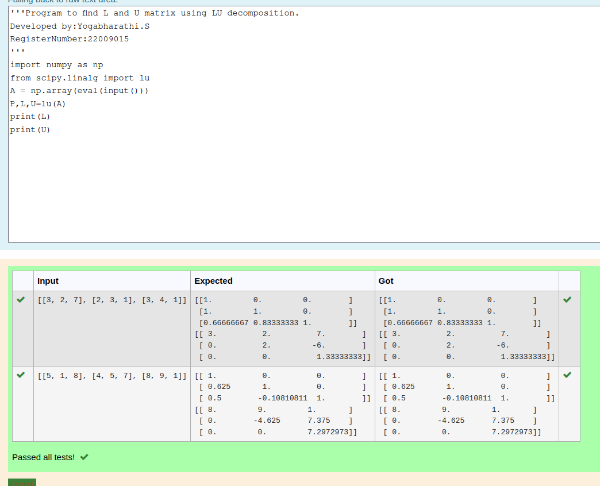
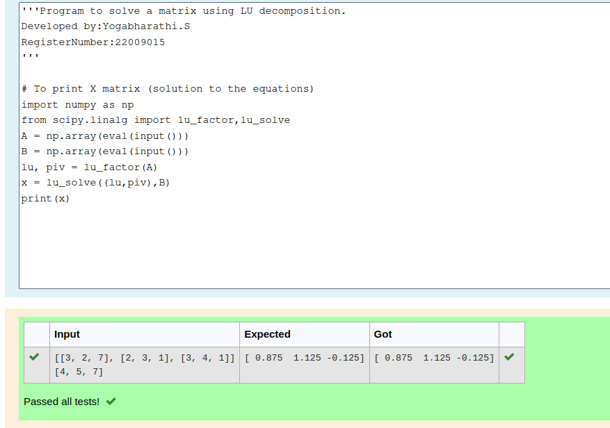

# LU Decomposition 

## AIM:
To write a program to find the LU Decomposition of a matrix.

## Equipments Required:
1. Hardware – PCs
2. Anaconda – Python 3.7 Installation / Moodle-Code Runner

## Algorithm
 1. To Find L and U matrices with LU Decomposition

 2. Get the matrix from the user.

 3. Using "from scipy.linalg import lu"to import scipy (LU)module.

 4. Using "L,U=lu(a)"we can get the matrix of L and U.

 5. Print the result matrices (L and U matrices).

 6. End the program.


## Program:
(i) To find the L and U matrix
```
/*
Program to find the L and U matrix.
Developed by:Yogabharathi.S
RegisterNumber:22009015 
/*
```
```python
import numpy as np
from scipy.linalg import lu
A = np.array(eval(input()))
P,L,U=lu(A)
print(L)
print(U) 
```
(ii) To find the LU Decomposition of a matrix
```
/*
Program to find the LU Decomposition of a matrix.
Developed by:Yogabhaarthi.S 
RegisterNumber: 22009015
*/
```
```python
import numpy as np
from scipy.linalg import lu_factor,lu_solve
A = np.array(eval(input()))
B = np.array(eval(input()))
lu, piv = lu_factor(A)
x = lu_solve((lu,piv),B)
print(x)
```
## Output:





## Result:
Thus the program to find the LU Decomposition of a matrix is written and verified using python programming.

